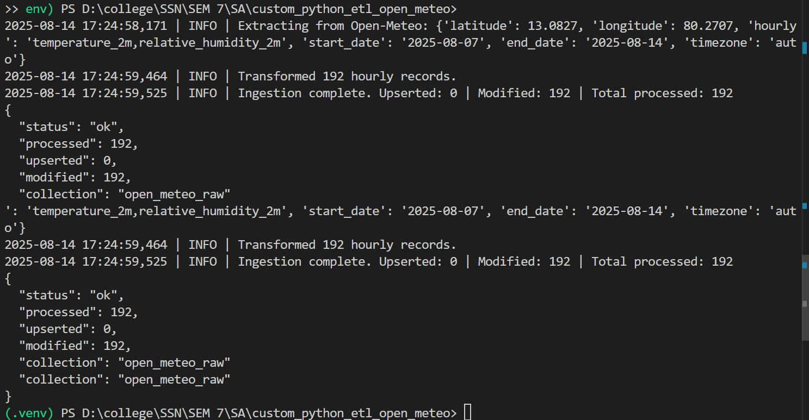
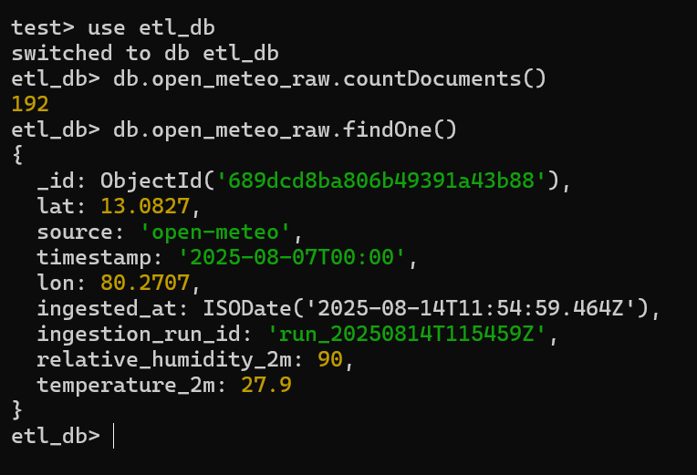

# Custom Python ETL Data Connector — Open‑Meteo → MongoDB

**Assignment Ready.** This repo contains a working ETL connector that:
- **Extracts** hourly weather data from Open‑Meteo (no API key).
- **Transforms** it into a flat JSON schema.
- **Loads** it into MongoDB (one collection per connector: `open_meteo_raw`).
- Stores `ingested_at` timestamp per record for audits.

> Swap the API anytime (e.g., News, GitHub, etc.). Keep the same ETL skeleton and env handling.

---

## 1) Project Structure
.
├─ etl_connector.py        # Main ETL script
├─ requirements.txt        # Python deps
├─ .env.example            # Copy to .env, fill values (never commit .env)
└─ README.md               # You are here

---

## 2) Setup (Windows PowerShell)
'''
# 1) Create & activate a venv
py -3 -m venv .venv
.\.venv\Scripts\Activate.ps1

# 2) Install deps
pip install -r requirements.txt

# 3) Create .env from template
copy .env.example .env
# then open .env in a text editor and adjust MONGO_URI/MONGO_DB if needed.
'''

> **MongoDB:** Use local MongoDB (`mongodb://localhost:27017/`) or Atlas. Ensure the database is reachable.

---

## 3) Run the ETL
Default location is **Chennai**; default range is last **7 days**.

# Example 1 — defaults (Chennai, last 7 days)
python etl_connector.py

# Example 2 — custom dates & vars
python etl_connector.py --lat 13.0827 --lon 80.2707 --start 2025-08-01 --end 2025-08-14 --hourly temperature_2m,relative_humidity_2m

Script prints a JSON summary and logs. Re‑running is safe (uses unique index + **upsert**).

## 4) Validate Inserts
With `mongosh`:

use etl_db
db.open_meteo_raw.countDocuments()
db.open_meteo_raw.findOne()

Schema (example):
{
  "source": "open-meteo",
  "lat": 13.0827,
  "lon": 80.2707,
  "timestamp": "2025-08-10T03:00",
  "temperature_2m": 28.1,
  "relative_humidity_2m": 82,
  "ingested_at": "2025-08-14T12:34:56Z",
  "ingestion_run_id": "run_20250814T123456Z"
}

---

## 5) Error Handling & Reliability
- Retries with backoff for `429/5xx` using `requests` + `urllib3.Retry`.
- Validates payload shape.
- Unique index on `(source, lat, lon, timestamp)` to prevent duplicates.
- Upserts instead of blind inserts.

---

## 6) Swap the API (if needed)
If your chosen API needs a key:
1. Put it in `.env` as `API_KEY=...` (never commit `.env`).
2. Read with `os.getenv("API_KEY")` in `etl_connector.py`.
3. Add required headers/query params in the `extract_*` function.

Keep the **one collection per connector** rule, e.g., `github_commits_raw`.

---

## 7) Submission Checklist (per assignment)
- [x] Understand API docs (Open‑Meteo params)
- [x] Secure creds via `.env` (Mongo URI; add API keys if needed)
- [x] Build full ETL (Extract → Transform → Load)
- [x] Validate inserts + handle errors/rate limits
- [x] Clean project structure
- [x] README with usage
- [x] Commit message includes *name + roll number*
- [x] Push to your branch & open PR

Suggested commit:
git add .
git commit -m "Sai Nikitha NSR — Roll No 118 — Open‑Meteo ETL connector complete"
git push origin main
---

### Credits
Built for **Kyureeus EdTech × SSN CSE** — Software Architecture assignment.

## Proof of Execution
python etl_connector.py

**Command Run:**

